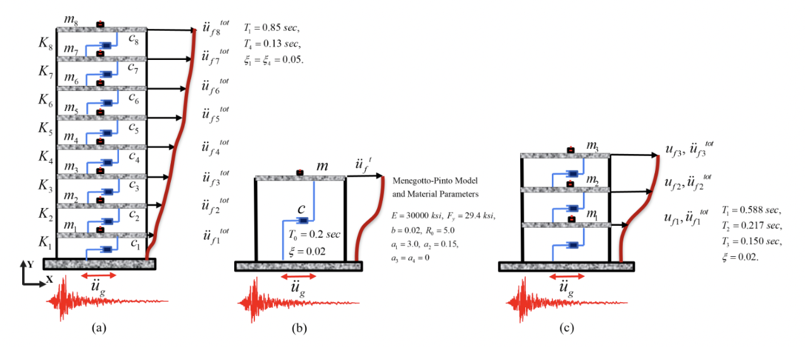

# Application of Long Short-Term Memory (LSTM) Networks-Based Surrogate Modeling for Nonlinear Structural Systems

#### Abdoul Aziz Sandotin Coulibaly 
#### Enrique Simbort Zeballos 
#### Yusuf Morsi 
#### Ramin Sarange

## Abstract
Performance-based seismic design (PBSD) of structural systems relies on computationally expensive high-fidelity finite element (FE) models to predict how structures will respond to seismic excitation. For risk-based assessments, FE response simulations must be run thousands of times with different realizations of the sources of uncertainty. Consequently, data-driven machine learning (DDML) surrogate models have gained prominence as fast emulators for predicting seismic structural responses in probabilistic analyses. This paper leverages deep Long Short-Term Memory (LSTM) networks, known for their powerful and flexible framework for time series prediction tasks. The advantages of using LSTM networks include their ability to model continuous-time processes, adapt to varying temporal resolutions, maintain implicit memory of past information, model complex nonlinear dynamics, perform interpolation and extrapolation, handle noisy data robustly, and scale effectively to high-dimensional datasets. The effectiveness of the proposed method is validated through three proof-of-concept studies: one involving a linear elastic 2D 8-degree-of-freedom (DoF) shear building model, a nonlinear single degree of freedom system (NL-SDoF), and a 2D nonlinear 3DoF shear building model. The findings indicate that the proposed LSTM network is a promising, dependable, and computationally efficient technique for predicting nonlinear structural responses.



## Instructions to Set Up and Run the LSTM Model

1. **Clone the Repository**
   
   Clone this repository to your local machine using the following command:
   
   ```bash
   git clone https://github.com/ymorsi7/LSTMsForNonlinearStructuralSystems.git
   cd LSTMsForNonlinearStructuralSystems
   ```
2. **Install Dependencies**
   Ensure you have Python 3.x installed on your system. Install the required dependencies using pip:
   ```bash
   pip install numpy matplotlib tensorflow keras scikit-learn joblib
   ```
3. **Prepare the Data** <br>

   Place the MATLAB data file `data_2DOF_SB_BWWN.mat` in the `LSTMsForNonlinearStructuralSystems` directory. This file should be available in the repository or provided separately.

4. **Run the Python File**
   
   Execute the provided Python script `2DOF_ShearBuild_LSTM_f.py` to train the LSTM model:

   ```bash
   python 2DOF_ShearBuild_LSTM_f.py
   ```

  This will:
  - Load the preprocessed data from the MATLAB file.
  - Normalize the data using MinMaxScaler.
  - Set up and train the LSTM model.
  - Evaluate the model performance.
  - Save the best-performing model.

5. **A/B Testing**
   The script also includes a section for A/B testing different LSTM architectures. This can be executed within the same script to compare performance metrics between two models.

## Report
To read our report, [click here](files/paper.pdf)


